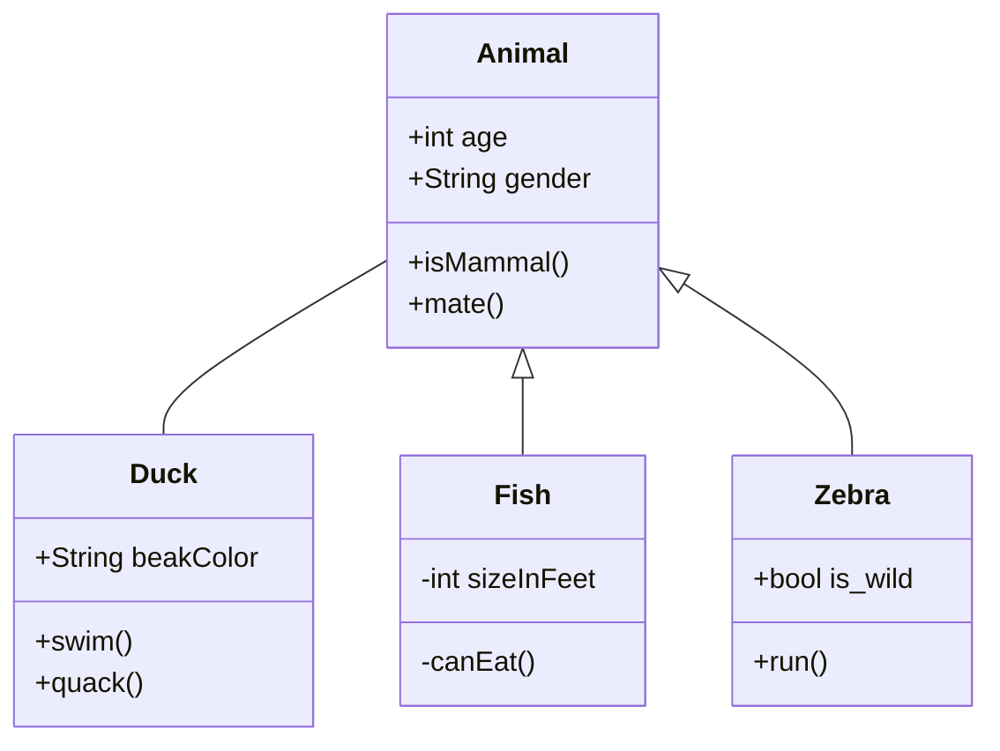

# title
teste

 

|aa|aa|
|--|--|
|AA|aa|

 
 
 

## TBCalculoLoop
|**Name**|**Type**|**Key**|**Auto**|**Parent**|**Description**|
|-|-|-|-|-|
|XVCalculoLoop|int|&check;|&check;|||
|XVCalculo|int|&#x2610;|&#x2610;|[TBCalculo]||
|XVLoopColuna|int|&#x2610;|&#x2610;|[TBLoopColuna]||
|NUIteracao|int|&#x2610;|&#x2610;|||
|DEValor|varchar|&#x2610;|&#x2610;|||
|DTInclusao|datetime|&#x2610;|&#x2610;|||
|DTAtualizacao|datetime|&#x2610;|&#x2610;|||
|FLComputarJuros|int|&#x2610;|&#x2610;|||
|FLComputarCorrecaoMonetaria|int|&#x2610;|&#x2610;|||
|FLRegistroEditado|bit|&#x2610;|&#x2610;|||

## TBLoopColuna
|**Name**|**Type**|**Key**|**Auto**|**Parent**|**Description**|
|-|-|-|-|-|
|XVLoopColuna|int|&check;|&check;|||
|XVMecanismoLoop|int|&#x2610;|&#x2610;|[TBMecanismoLoop]||
|XVTipoDado|int|&#x2610;|&#x2610;|[TBTipoDado]||
|NMVariavel|varchar|&#x2610;|&#x2610;|||
|DELegenda|varchar|&#x2610;|&#x2610;|||
|DESignificado|varchar|&#x2610;|&#x2610;|||
|DEFormula|varchar|&#x2610;|&#x2610;|||
|NUOrdem|smallint|&#x2610;|&#x2610;|||
|DEMascara|varchar|&#x2610;|&#x2610;|||
|FLMostrar|bit|&#x2610;|&#x2610;|||
|DTInclusao|datetime|&#x2610;|&#x2610;|||
|TSLinha|timestamp|&#x2610;|&#x2610;|||
|DEOrientacao|varchar|&#x2610;|&#x2610;|||
|FLHabilitarEdicao|char|&#x2610;|&#x2610;|||
|FLMostrarEdicao|bit|&#x2610;|&#x2610;|||
|TPChamadaExecucao|bit|&#x2610;|&#x2610;|||

## TBCalculoFormula
|**Name**|**Type**|**Key**|**Auto**|**Parent**|**Description**|
|-|-|-|-|-|
|XVCalculoFormula|int|&check;|&check;|||
|XVCalculo|int|&#x2610;|&#x2610;|[TBCalculo]||
|XVMecanismoFormula|int|&#x2610;|&#x2610;|[TBMecanismoFormula]||
|DEValor|varchar|&#x2610;|&#x2610;|||
|FLComputarCorrecaoMonetaria|int|&#x2610;|&#x2610;|||
|FLComputarJuros|int|&#x2610;|&#x2610;|||

## TBCalculoEntrada
|**Name**|**Type**|**Key**|**Auto**|**Parent**|**Description**|
|-|-|-|-|-|
|XVCalculoEntrada|int|&check;|&check;|||
|XVCalculo|int|&#x2610;|&#x2610;|[TBCalculo]||
|XVMecanismoEntrada|int|&#x2610;|&#x2610;|[TBMecanismoEntrada]||
|DEValor|varchar|&#x2610;|&#x2610;|||

## TBMecanismoLoop
|**Name**|**Type**|**Key**|**Auto**|**Parent**|**Description**|
|-|-|-|-|-|
|XVMecanismoLoop|int|&check;|&check;|||
|XVMecanismo|int|&#x2610;|&#x2610;|[TBMecanismo]||
|XVTipoIncremento|int|&#x2610;|&#x2610;|[TBTipoIncremento]||
|VLIncremento|smallint|&#x2610;|&#x2610;|||
|NMVariavelInicial|varchar|&#x2610;|&#x2610;|||
|NMVariavelFinal|varchar|&#x2610;|&#x2610;|||
|XVMecanismoLoopBase|int|&#x2610;|&#x2610;|||
|DTInclusao|datetime|&#x2610;|&#x2610;|||
|TSLinha|timestamp|&#x2610;|&#x2610;|||

## TBMecanismoFormula
|**Name**|**Type**|**Key**|**Auto**|**Parent**|**Description**|
|-|-|-|-|-|
|XVMecanismoFormula|int|&check;|&check;|||
|XVMecanismo|int|&#x2610;|&#x2610;|[TBMecanismo]||
|XVTipoDado|int|&#x2610;|&#x2610;|[TBTipoDado]||
|NMVariavel|varchar|&#x2610;|&#x2610;|||
|DELegenda|varchar|&#x2610;|&#x2610;|||
|DESignificado|varchar|&#x2610;|&#x2610;|||
|DEFormula|varchar|&#x2610;|&#x2610;|||
|NUOrdem|smallint|&#x2610;|&#x2610;|||
|DEMascara|varchar|&#x2610;|&#x2610;|||
|TPExecucao|char|&#x2610;|&#x2610;|||
|DTInclusao|datetime|&#x2610;|&#x2610;|||
|TSLinha|timestamp|&#x2610;|&#x2610;|||
|DEOrientacao|varchar|&#x2610;|&#x2610;|||
|TPChamadaExecucao|tinyint|&#x2610;|&#x2610;|||

## TBMecanismoEntrada
|**Name**|**Type**|**Key**|**Auto**|**Parent**|**Description**|
|-|-|-|-|-|
|XVMecanismoEntrada|int|&check;|&check;|||
|XVMecanismo|int|&#x2610;|&#x2610;|[TBMecanismo]||
|XVTipoDado|int|&#x2610;|&#x2610;|[TBTipoDado]||
|XVTabelaGenerica|int|&#x2610;|&#x2610;|[TBTabelaGenerica]||
|NMVariavel|varchar|&#x2610;|&#x2610;|||
|DELegenda|varchar|&#x2610;|&#x2610;|||
|DESignificado|varchar|&#x2610;|&#x2610;|||
|NUOrdem|smallint|&#x2610;|&#x2610;|||
|NUTamanho|smallint|&#x2610;|&#x2610;|||
|DEMascara|varchar|&#x2610;|&#x2610;|||
|DTInclusao|datetime|&#x2610;|&#x2610;|||
|TSLinha|timestamp|&#x2610;|&#x2610;|||
|DEOrientacao|varchar|&#x2610;|&#x2610;|||
|FLVisivel|bit|&#x2610;|&#x2610;|||
|required|int|&#x2610;|&#x2610;|||

## TBTabelaGenericaItem
|**Name**|**Type**|**Key**|**Auto**|**Parent**|**Description**|
|-|-|-|-|-|
|XVItem|int|&check;|&check;|||
|XVTabelaGenerica|int|&#x2610;|&#x2610;|[TBTabelaGenerica]||
|DEItem|nvarchar|&#x2610;|&#x2610;|||
|DTInclusao|datetime|&#x2610;|&#x2610;|||
|TSLinha|timestamp|&#x2610;|&#x2610;|||

## TBSoldoGapNovo
|**Name**|**Type**|**Key**|**Auto**|**Parent**|**Description**|
|-|-|-|-|-|
|XVSoldoGap|int|&check;|&check;|||
|NUAno|int|&#x2610;|&#x2610;|||
|XVPatente|int|&#x2610;|&#x2610;|[TBPatente]||
|VLSoldo|decimal|&#x2610;|&#x2610;|||
|VLGAPI|decimal|&#x2610;|&#x2610;|||
|VLGAPII|decimal|&#x2610;|&#x2610;|||
|VLGAPIII|decimal|&#x2610;|&#x2610;|||
|VLGAPIV|decimal|&#x2610;|&#x2610;|||
|VLGAPV|decimal|&#x2610;|&#x2610;|||
|DTMesFolha|varchar|&#x2610;|&#x2610;|||

## TBCalculo
|**Name**|**Type**|**Key**|**Auto**|**Parent**|**Description**|
|-|-|-|-|-|
|XVCalculo|int|&check;|&check;|||
|XVMecanismo|int|&#x2610;|&#x2610;|[TBMecanismo]||
|DTExecucao|datetime|&#x2610;|&#x2610;|||
|NMCalculo|varchar|&#x2610;|&#x2610;|||
|NUVersao|int|&#x2610;|&#x2610;|||
|DECalculo|varchar|&#x2610;|&#x2610;|||
|CDUsuario|varchar|&#x2610;|&#x2610;|||
|TPEstagioCalculo|smallint|&#x2610;|&#x2610;|||
|DTInclusao|datetime|&#x2610;|&#x2610;|||
|TSLinha|timestamp|&#x2610;|&#x2610;|||
|XVCalculoLote|int|&#x2610;|&#x2610;|[TBCalculoLote]||

## RHU_CONTRACHEQUES
|**Name**|**Type**|**Key**|**Auto**|**Parent**|**Description**|
|-|-|-|-|-|
|ID|int|&check;|&check;|||
|CodigoArquivo|int|&#x2610;|&#x2610;|||
|CodigoArquivo_Descr|varchar|&#x2610;|&#x2610;|||
|TipoFolha|int|&#x2610;|&#x2610;|||
|TipoFolha_Descr|varchar|&#x2610;|&#x2610;|||
|Data_Referencia|int|&#x2610;|&#x2610;|||
|Data_Pagamento|int|&#x2610;|&#x2610;|||
|Orgao|int|&#x2610;|&#x2610;|||
|Orgao_Sigla|varchar|&#x2610;|&#x2610;|||
|Matricula|varchar|&#x2610;|&#x2610;|||
|CodigoServidorOuPensionista|varchar|&#x2610;|&#x2610;|||
|CodigoServidorOuPensionista_Descr|varchar|&#x2610;|&#x2610;|||
|NomeBeneficiario|varchar|&#x2610;|&#x2610;|||
|CPF|varchar|&#x2610;|&#x2610;|||
|Nascimento|varchar|&#x2610;|&#x2610;|||
|UnidadeOrcamentaria|int|&#x2610;|&#x2610;|||
|UnidadeOrcamentaria_Descr|varchar|&#x2610;|&#x2610;|||
|LocalTrabalho|int|&#x2610;|&#x2610;|||
|LocalTrabalho_Descr|varchar|&#x2610;|&#x2610;|||
|Admissao|varchar|&#x2610;|&#x2610;|||
|SituacaoFuncional|int|&#x2610;|&#x2610;|||
|SituacaoFuncional_Descr|varchar|&#x2610;|&#x2610;|||
|DataSituacao|varchar|&#x2610;|&#x2610;|||
|CategoriaFuncional|int|&#x2610;|&#x2610;|||
|CategoriaFuncional_Descr|varchar|&#x2610;|&#x2610;|||
|CargoPermanente|int|&#x2610;|&#x2610;|||
|CargoPermanente_Descr|varchar|&#x2610;|&#x2610;|||
|CargaHoraria|varchar|&#x2610;|&#x2610;|||
|GrupoOcupacional|int|&#x2610;|&#x2610;|||
|GrupoOcupacional_Descr|varchar|&#x2610;|&#x2610;|||
|NivelNovoCargo|varchar|&#x2610;|&#x2610;|||
|ClasseNovoCargo|varchar|&#x2610;|&#x2610;|||
|RefSalarialNovoCargo|int|&#x2610;|&#x2610;|||
|PadraoNovoCargo|varchar|&#x2610;|&#x2610;|||
|GrauNovoCargo|varchar|&#x2610;|&#x2610;|||
|TipoRemuneracao|int|&#x2610;|&#x2610;|||
|TipoRemuneracao_Descr|varchar|&#x2610;|&#x2610;|||
|SalarioBase|varchar|&#x2610;|&#x2610;|||
|TipoCargoTemporario|varchar|&#x2610;|&#x2610;|||
|TipoCargoTemporario_Descr|varchar|&#x2610;|&#x2610;|||
|CodigoCargoTemporario|int|&#x2610;|&#x2610;|||
|CodigoCargoTemporario_Descr|varchar|&#x2610;|&#x2610;|||
|TipoEconomicoFuncIncorporada|varchar|&#x2610;|&#x2610;|||
|TipoEconomicoFuncIncorporada_Descr|varchar|&#x2610;|&#x2610;|||
|FuncaoIncorporada|int|&#x2610;|&#x2610;|||
|FuncaoIncorporada_Descr|varchar|&#x2610;|&#x2610;|||
|Estabilidade|int|&#x2610;|&#x2610;|||
|Estabilidade_Descr|varchar|&#x2610;|&#x2610;|||
|EstabilidadePercentual|varchar|&#x2610;|&#x2610;|||
|NomePensionista|varchar|&#x2610;|&#x2610;|||
|CPF_Pensionista|varchar|&#x2610;|&#x2610;|||
|NascimentoPensionista|varchar|&#x2610;|&#x2610;|||
|InicioPensao|varchar|&#x2610;|&#x2610;|||
|FinalPensao|varchar|&#x2610;|&#x2610;|||
|Pensao|int|&#x2610;|&#x2610;|||
|Pensao_Descr|varchar|&#x2610;|&#x2610;|||
|Parentesco|int|&#x2610;|&#x2610;|||
|Parentesco_Descr|varchar|&#x2610;|&#x2610;|||
|QTVerbas|int|&#x2610;|&#x2610;|||
|FTP_ID|int|&#x2610;|&#x2610;|[LOG_FTP]||
|DTInclusao|datetime|&#x2610;|&#x2610;|||
|FLUso|bit|&#x2610;|&#x2610;|||

## GER_MOEDA_VALOR
|**Name**|**Type**|**Key**|**Auto**|**Parent**|**Description**|
|-|-|-|-|-|
|ID|int|&check;|&#x2610;|||
|MOEDA_ID|int|&#x2610;|&#x2610;|[GER_MOEDA]||
|REFERENCIA|int|&#x2610;|&#x2610;|||
|VALOR_INICIAL|numeric|&#x2610;|&#x2610;|||
|FATOR_CONVERSAO|numeric|&#x2610;|&#x2610;|||
|CORRECAO_MONETARIA|numeric|&#x2610;|&#x2610;|||
|VALOR_ATUALIZADO|numeric|&#x2610;|&#x2610;|||
|JUROS_PERCENTUAL|numeric|&#x2610;|&#x2610;|||
|JUROS_VALOR|numeric|&#x2610;|&#x2610;|||
|VALOR_ATUALIZADOxJUROS|numeric|&#x2610;|&#x2610;|||
|DATA_INCLUSAO|varchar|&#x2610;|&#x2610;|||
|DATA_ALTERACAO|varchar|&#x2610;|&#x2610;|||

## GER_INDICE_VALOR
|**Name**|**Type**|**Key**|**Auto**|**Parent**|**Description**|
|-|-|-|-|-|
|ID|int|&check;|&check;|||
|INDICE_ID|int|&#x2610;|&#x2610;|[GER_INDICE]||
|REFERENCIA|int|&#x2610;|&#x2610;|||
|REFERENCIA_FINAL|int|&#x2610;|&#x2610;|||
|FAIXA_INI|numeric|&#x2610;|&#x2610;|||
|FAIXA_FIM|numeric|&#x2610;|&#x2610;|||
|VALOR|numeric|&#x2610;|&#x2610;|||
|DATA_INCLUSAO|varchar|&#x2610;|&#x2610;|||
|DATA_ALTERACAO|varchar|&#x2610;|&#x2610;|||
|VALOR_TETO|numeric|&#x2610;|&#x2610;|||
|VALOR_DEDUCAO|numeric|&#x2610;|&#x2610;|||
|VALOR_OUTROS|numeric|&#x2610;|&#x2610;|||

## GER_INDICE_AGRUPADO
|**Name**|**Type**|**Key**|**Auto**|**Parent**|**Description**|
|-|-|-|-|-|
|ID|int|&check;|&check;|||
|REFERENCIA|int|&#x2610;|&#x2610;|||
|VALOR|numeric|&#x2610;|&#x2610;|||
|INDICE_ID|int|&#x2610;|&#x2610;|[GER_INDICE]||

## GER_CARGO_VALOR
|**Name**|**Type**|**Key**|**Auto**|**Parent**|**Description**|
|-|-|-|-|-|
|ID|int|&check;|&#x2610;|||
|CARGO_ID|int|&#x2610;|&#x2610;|[GER_CARGO]||
|REMUNERACAO_ID|int|&#x2610;|&#x2610;|||
|REFERENCIA|int|&#x2610;|&#x2610;|||
|VALOR|numeric|&#x2610;|&#x2610;|||
|DATA_INCLUSAO|varchar|&#x2610;|&#x2610;|||
|DATA_ALTERACAO|varchar|&#x2610;|&#x2610;|||

## Usuario
|**Name**|**Type**|**Key**|**Auto**|**Parent**|**Description**|
|-|-|-|-|-|
|id|int|&#x2610;|&#x2610;|||
|nome|varchar|&#x2610;|&#x2610;|||
|login|varchar|&#x2610;|&#x2610;|||
|senha|varchar|&#x2610;|&#x2610;|||
|eMail|varchar|&#x2610;|&#x2610;|||
|usuarioAD|bit|&#x2610;|&#x2610;|||
|perfil|varchar|&#x2610;|&#x2610;|||

## TEMP_QTD_MAT_DATA_REFERENCIA
|**Name**|**Type**|**Key**|**Auto**|**Parent**|**Description**|
|-|-|-|-|-|
|Data_Referencia|int|&#x2610;|&#x2610;|||
|CENTRALIZADA|int|&#x2610;|&#x2610;|||
|EMPRESAS|int|&#x2610;|&#x2610;|||
|INATIVOS|int|&#x2610;|&#x2610;|||
|PREVIDENCIA|int|&#x2610;|&#x2610;|||

## TEMP_QTD_CC_DATA_REFERENCIA
|**Name**|**Type**|**Key**|**Auto**|**Parent**|**Description**|
|-|-|-|-|-|
|Data_Referencia|int|&#x2610;|&#x2610;|||
|CENTRALIZADA|int|&#x2610;|&#x2610;|||
|EMPRESAS|int|&#x2610;|&#x2610;|||
|INATIVOS|int|&#x2610;|&#x2610;|||
|PREVIDENCIA|int|&#x2610;|&#x2610;|||

## TEMP_QTD_CC_DATA_ARQUIVO
|**Name**|**Type**|**Key**|**Auto**|**Parent**|**Description**|
|-|-|-|-|-|
|Data_arquivo|varchar|&#x2610;|&#x2610;|||
|CENTRALIZADA|int|&#x2610;|&#x2610;|||
|EMPRESAS|int|&#x2610;|&#x2610;|||
|INATIVOS|int|&#x2610;|&#x2610;|||
|PREVIDENCIA|int|&#x2610;|&#x2610;|||

## TEMP_DATA_REFERENCIA
|**Name**|**Type**|**Key**|**Auto**|**Parent**|**Description**|
|-|-|-|-|-|
|Data_Referencia|int|&#x2610;|&#x2610;|||

## temp_contracheques_duplicados4
|**Name**|**Type**|**Key**|**Auto**|**Parent**|**Description**|
|-|-|-|-|-|
|Data_Referencia|int|&#x2610;|&#x2610;|||
|NomeArquivo|varchar|&#x2610;|&#x2610;|||
|DataFTP|varchar|&#x2610;|&#x2610;|||
|ID|int|&#x2610;|&#x2610;|||
|MATRICULA|varchar|&#x2610;|&#x2610;|||
|FTP_ID|int|&#x2610;|&#x2610;|||
|TipoFolha|int|&#x2610;|&#x2610;|||
|CodigoServidorOuPensionista|varchar|&#x2610;|&#x2610;|||

## temp_contracheques_duplicados3
|**Name**|**Type**|**Key**|**Auto**|**Parent**|**Description**|
|-|-|-|-|-|
|CodigoArquivo|int|&#x2610;|&#x2610;|||
|Data_Referencia|int|&#x2610;|&#x2610;|||
|TipoFolha|int|&#x2610;|&#x2610;|||
|Matricula|varchar|&#x2610;|&#x2610;|||
|CodigoServidorOuPensionista|varchar|&#x2610;|&#x2610;|||
|Orgao|int|&#x2610;|&#x2610;|||
|UnidadeOrcamentaria|int|&#x2610;|&#x2610;|||
|LocalTrabalho|int|&#x2610;|&#x2610;|||
|Admissao|varchar|&#x2610;|&#x2610;|||
|SituacaoFuncional|int|&#x2610;|&#x2610;|||
|SalarioBase|varchar|&#x2610;|&#x2610;|||
|QTVerbas|int|&#x2610;|&#x2610;|||
|quantidade|int|&#x2610;|&#x2610;|||

## TEMP_CC_DUPLICADOS_CONFIRMADOS
|**Name**|**Type**|**Key**|**Auto**|**Parent**|**Description**|
|-|-|-|-|-|
|Matricula|varchar|&#x2610;|&#x2610;|||
|Data_Referencia|int|&#x2610;|&#x2610;|||
|SOMA|float|&#x2610;|&#x2610;|||
|QTD_DUPLICADOS|int|&#x2610;|&#x2610;|||

## TEMP_CC_DUPLICADOS
|**Name**|**Type**|**Key**|**Auto**|**Parent**|**Description**|
|-|-|-|-|-|
|ID|int|&#x2610;|&check;|||
|Data_Referencia|int|&#x2610;|&#x2610;|||
|Matricula|varchar|&#x2610;|&#x2610;|||
|TipoFolha|int|&#x2610;|&#x2610;|||
|CodigoServidorOuPensionista|varchar|&#x2610;|&#x2610;|||

## TEMP_CC_APAGAR
|**Name**|**Type**|**Key**|**Auto**|**Parent**|**Description**|
|-|-|-|-|-|
|Matricula|varchar|&#x2610;|&#x2610;|||
|Data_Referencia|int|&#x2610;|&#x2610;|||
|ID_CONTRACHEQUE_APAGAR|int|&#x2610;|&#x2610;|||

## TBVantagemVerba
|**Name**|**Type**|**Key**|**Auto**|**Parent**|**Description**|
|-|-|-|-|-|
|XVVantagemVerba|int|&#x2610;|&check;|||
|CodigoVantagemDesconto|int|&#x2610;|&#x2610;|||
|CodigoVantagemDescontoDescr|varchar|&#x2610;|&#x2610;|||
|GrupoOcupacional|int|&#x2610;|&#x2610;|||
|GrupoOcupacional_Descr|varchar|&#x2610;|&#x2610;|||

## TBVantagemContraCheque
|**Name**|**Type**|**Key**|**Auto**|**Parent**|**Description**|
|-|-|-|-|-|
|XVVantagemContraCheque|int|&#x2610;|&check;|||
|CodigoVantagemDesconto|int|&#x2610;|&#x2610;|||
|CodigoVantagemDescontoDescr|varchar|&#x2610;|&#x2610;|||
|GrupoOcupacional|int|&#x2610;|&#x2610;|||
|GrupoOcupacional_Descr|varchar|&#x2610;|&#x2610;|||
|CargoPermanente_Descr|varchar|&#x2610;|&#x2610;|||
|CargoPermanente|varchar|&#x2610;|&#x2610;|||

## TBValorFixoRelatorio
|**Name**|**Type**|**Key**|**Auto**|**Parent**|**Description**|
|-|-|-|-|-|
|XVValorFixoRelatorio|int|&#x2610;|&check;|||
|DEValor|varchar|&#x2610;|&#x2610;|||
|NMVariavel|varchar|&#x2610;|&#x2610;|||
|FLMostrar|bit|&#x2610;|&#x2610;|||
|XVTipoDado|int|&#x2610;|&#x2610;|||
|DEOrientacao|varchar|&#x2610;|&#x2610;|||

## TBTipoIndiceCorrecaoMonet
|**Name**|**Type**|**Key**|**Auto**|**Parent**|**Description**|
|-|-|-|-|-|
|XVTipoIndiceCorrecaoMonet|int|&#x2610;|&check;|||
|DETipo|varchar|&#x2610;|&#x2610;|||

## TBTipoIncremento
|**Name**|**Type**|**Key**|**Auto**|**Parent**|**Description**|
|-|-|-|-|-|
|XVTipoIncremento|int|&check;|&#x2610;|||
|NMTipoIncremento|varchar|&#x2610;|&#x2610;|||
|DTInclusao|datetime|&#x2610;|&#x2610;|||
|TSLinha|timestamp|&#x2610;|&#x2610;|||

## TBTipoDado
|**Name**|**Type**|**Key**|**Auto**|**Parent**|**Description**|
|-|-|-|-|-|
|XVTipoDado|int|&check;|&#x2610;|||
|NMTipoDado|varchar|&#x2610;|&#x2610;|||
|DTInclusao|datetime|&#x2610;|&#x2610;|||
|TSLinha|timestamp|&#x2610;|&#x2610;|||

## TBTabLimiteConstitucional
|**Name**|**Type**|**Key**|**Auto**|**Parent**|**Description**|
|-|-|-|-|-|
|XVLimite|int|&check;|&check;|||
|DTLimite|date|&#x2610;|&#x2610;|||
|VLGovernador|decimal|&#x2610;|&#x2610;|||
|VLDesembargador|decimal|&#x2610;|&#x2610;|||

## TBTabIndiceCorrecaoMonet
|**Name**|**Type**|**Key**|**Auto**|**Parent**|**Description**|
|-|-|-|-|-|
|XVIndice|int|&check;|&check;|||
|DTIndice|date|&#x2610;|&#x2610;|||
|VLAbsolutoIndice|decimal|&#x2610;|&#x2610;|||
|NMMoeda|varchar|&#x2610;|&#x2610;|||
|NMIndice|varchar|&#x2610;|&#x2610;|||

## TBTabGAP
|**Name**|**Type**|**Key**|**Auto**|**Parent**|**Description**|
|-|-|-|-|-|
|XVGap|int|&#x2610;|&#x2610;|||
|NUAnoMes|int|&#x2610;|&#x2610;|||
|VLSoldo|decimal|&#x2610;|&#x2610;|||
|VLGAP1|decimal|&#x2610;|&#x2610;|||
|VLGAP2|decimal|&#x2610;|&#x2610;|||
|VLGAP3|decimal|&#x2610;|&#x2610;|||
|VLGAP4A|decimal|&#x2610;|&#x2610;|||
|VLGAP5|decimal|&#x2610;|&#x2610;|||
|NMPatente|nvarchar|&#x2610;|&#x2610;|||
|VLGAP|decimal|&#x2610;|&#x2610;|||

## TBTabelaGenerica
|**Name**|**Type**|**Key**|**Auto**|**Parent**|**Description**|
|-|-|-|-|-|
|XVTabelaGenerica|int|&check;|&#x2610;|||
|NMTabelaGenerica|nvarchar|&#x2610;|&#x2610;|||
|DTInclusao|datetime|&#x2610;|&#x2610;|||
|TSLinha|timestamp|&#x2610;|&#x2610;|||

## TBSoldoGapPMEstendida
|**Name**|**Type**|**Key**|**Auto**|**Parent**|**Description**|
|-|-|-|-|-|
|XVSoldoGap|int|&check;|&check;|||
|NUAno|int|&#x2610;|&#x2610;|||
|XVPatente|int|&#x2610;|&#x2610;|||
|VLSoldo|decimal|&#x2610;|&#x2610;|||
|VLGAPI|decimal|&#x2610;|&#x2610;|||
|VLGAPII|decimal|&#x2610;|&#x2610;|||
|VLGAPIII|decimal|&#x2610;|&#x2610;|||
|VLGAPIV|decimal|&#x2610;|&#x2610;|||
|VLGAPV|decimal|&#x2610;|&#x2610;|||
|DTMesFolha|varchar|&#x2610;|&#x2610;|||

## TBSoldoGap2
|**Name**|**Type**|**Key**|**Auto**|**Parent**|**Description**|
|-|-|-|-|-|
|XVSoldoGap|int|&#x2610;|&check;|||
|NUAno|int|&#x2610;|&#x2610;|||
|XVPatente|int|&#x2610;|&#x2610;|||
|VLSoldo|decimal|&#x2610;|&#x2610;|||
|VLGAPI|decimal|&#x2610;|&#x2610;|||
|VLGAPII|decimal|&#x2610;|&#x2610;|||
|VLGAPIII|decimal|&#x2610;|&#x2610;|||
|VLGAPIV|decimal|&#x2610;|&#x2610;|||
|VLGAPV|decimal|&#x2610;|&#x2610;|||
|DTMesFolha|varchar|&#x2610;|&#x2610;|||

## TBSoldoGap
|**Name**|**Type**|**Key**|**Auto**|**Parent**|**Description**|
|-|-|-|-|-|
|XVSoldoGap|int|&#x2610;|&check;|||
|NUAno|int|&#x2610;|&#x2610;|||
|XVPatente|int|&#x2610;|&#x2610;|||
|VLSoldo|decimal|&#x2610;|&#x2610;|||
|VLGAPI|decimal|&#x2610;|&#x2610;|||
|VLGAPII|decimal|&#x2610;|&#x2610;|||
|VLGAPIII|decimal|&#x2610;|&#x2610;|||
|VLGAPIV|decimal|&#x2610;|&#x2610;|||
|VLGAPV|decimal|&#x2610;|&#x2610;|||
|DTMesFolha|varchar|&#x2610;|&#x2610;|||

## TBResumoRelatorioValores
|**Name**|**Type**|**Key**|**Auto**|**Parent**|**Description**|
|-|-|-|-|-|
|XVMecanismoRelatorioValores|int|&#x2610;|&check;|||
|XVResumoRelatorio|int|&#x2610;|&#x2610;|||
|NMView|varchar|&#x2610;|&#x2610;|||
|NMColunaValor|varchar|&#x2610;|&#x2610;|||
|NMVariaveis|varchar|&#x2610;|&#x2610;|||
|NUPosicaoColuna|varchar|&#x2610;|&#x2610;|||
|NMParemetros|varchar|&#x2610;|&#x2610;|||

## TBResumoRelatorio
|**Name**|**Type**|**Key**|**Auto**|**Parent**|**Description**|
|-|-|-|-|-|
|XVResumoRelatorio|int|&#x2610;|&check;|||
|XVMecanismo|int|&#x2610;|&#x2610;|||

## TBRelatorio
|**Name**|**Type**|**Key**|**Auto**|**Parent**|**Description**|
|-|-|-|-|-|
|XVRelatorio|int|&#x2610;|&check;|||
|XVCalculo|int|&#x2610;|&#x2610;|||
|NMRelatorio|varchar|&#x2610;|&#x2610;|||
|DEAssinatura|varchar|&#x2610;|&#x2610;|||
|DTCriacao|datetime|&#x2610;|&#x2610;|||
|DTGeracao|datetime|&#x2610;|&#x2610;|||

## TBPatente
|**Name**|**Type**|**Key**|**Auto**|**Parent**|**Description**|
|-|-|-|-|-|
|XVPatente|int|&#x2610;|&check;|||
|NMPatente|varchar|&#x2610;|&#x2610;|||
|NMPatenteBD|varchar|&#x2610;|&#x2610;|||
|NUOrdemPatente|int|&#x2610;|&#x2610;|||

## TBParecerSecaoVariavel
|**Name**|**Type**|**Key**|**Auto**|**Parent**|**Description**|
|-|-|-|-|-|
|XVParecerSecaoVariavel|int|&#x2610;|&check;|||
|NMVariavel|varchar|&#x2610;|&#x2610;|||
|XVTipoDado|int|&#x2610;|&#x2610;|||
|XVParecerSecao|int|&#x2610;|&#x2610;|||
|DEFormula|varchar|&#x2610;|&#x2610;|||
|DEMascara|varchar|&#x2610;|&#x2610;|||
|NMView|varchar|&#x2610;|&#x2610;|||
|DEVariaveisView|varchar|&#x2610;|&#x2610;|||
|TPChamada|smallint|&#x2610;|&#x2610;|||

## TBParecerSecao
|**Name**|**Type**|**Key**|**Auto**|**Parent**|**Description**|
|-|-|-|-|-|
|XVParecerSecao|int|&#x2610;|&check;|||
|XVParecer|int|&#x2610;|&#x2610;|||
|DESecao|varchar|&#x2610;|&#x2610;|||
|NUOrdem|smallint|&#x2610;|&#x2610;|||
|NUAgrupamento|smallint|&#x2610;|&#x2610;|||
|NMTipo|varchar|&#x2610;|&#x2610;|||
|FLAtivo|bit|&#x2610;|&#x2610;|||
|DEResumo|varchar|&#x2610;|&#x2610;|||
|NUFolha|smallint|&#x2610;|&#x2610;|||

## TBParecerOpcao
|**Name**|**Type**|**Key**|**Auto**|**Parent**|**Description**|
|-|-|-|-|-|
|XVParecerOpcao|int|&#x2610;|&check;|||
|NMKey|varchar|&#x2610;|&#x2610;|||
|DEValor|varchar|&#x2610;|&#x2610;|||
|XVCalculo|int|&#x2610;|&#x2610;|||
|XVParecerSecao|int|&#x2610;|&#x2610;|||
|XVParecer|int|&#x2610;|&#x2610;|||

## TBParecerDados
|**Name**|**Type**|**Key**|**Auto**|**Parent**|**Description**|
|-|-|-|-|-|
|XVParecerDados|int|&#x2610;|&check;|||
|XVParecerSecaoVariavel|int|&#x2610;|&#x2610;|||
|DEValor|varchar|&#x2610;|&#x2610;|||
|CDUsuario|varchar|&#x2610;|&#x2610;|||
|XVCalculo|int|&#x2610;|&#x2610;|||
|XVParecer|int|&#x2610;|&#x2610;|||

## TBParecerCalculo
|**Name**|**Type**|**Key**|**Auto**|**Parent**|**Description**|
|-|-|-|-|-|
|DESecao|varchar|&#x2610;|&#x2610;|||
|XVCalculo|int|&#x2610;|&#x2610;|||
|XVParecer|int|&#x2610;|&#x2610;|||
|NUOrdem|int|&#x2610;|&#x2610;|||
|XVParecerSecao|int|&#x2610;|&#x2610;|||

## TBParecer
|**Name**|**Type**|**Key**|**Auto**|**Parent**|**Description**|
|-|-|-|-|-|
|XVParecer|int|&#x2610;|&check;|||
|NMParecer|varchar|&#x2610;|&#x2610;|||
|FLAtivo|bit|&#x2610;|&#x2610;|||

## TBOficialPM
|**Name**|**Type**|**Key**|**Auto**|**Parent**|**Description**|
|-|-|-|-|-|
|Matricula|varchar|&#x2610;|&#x2610;|||
|CPF|varchar|&#x2610;|&#x2610;|||
|Data_referencia|varchar|&#x2610;|&#x2610;|||

## TBMetaTaxaSelic
|**Name**|**Type**|**Key**|**Auto**|**Parent**|**Description**|
|-|-|-|-|-|
|XVMetaTaxaSelic|int|&#x2610;|&check;|||
|DTApuracao|datetime|&#x2610;|&#x2610;|||
|VLMeta|real|&#x2610;|&#x2610;|||
|DTAtualizacao|datetime|&#x2610;|&#x2610;|||

## TBMecanismoRelatorioViews
|**Name**|**Type**|**Key**|**Auto**|**Parent**|**Description**|
|-|-|-|-|-|
|XVMecanismoRelatorio|int|&#x2610;|&#x2610;|||
|NMVIew|varchar|&#x2610;|&#x2610;|||
|XVMecanismoRelatorioViews|int|&#x2610;|&check;|||
|NMColuna|varchar|&#x2610;|&#x2610;|||
|NMVariavel|varchar|&#x2610;|&#x2610;|||
|NUPosicao|varchar|&#x2610;|&#x2610;|||
|NUOrdem|smallint|&#x2610;|&#x2610;|||
|NMVariavelLoopPosicaoTotal|varchar|&#x2610;|&#x2610;|||

## TBMecanismoRelatorioParametros
|**Name**|**Type**|**Key**|**Auto**|**Parent**|**Description**|
|-|-|-|-|-|
|NMParametro|varchar|&#x2610;|&#x2610;|||
|DEValor|varchar|&#x2610;|&#x2610;|||
|XVMecanismoRelatorioViews|int|&#x2610;|&#x2610;|||

## TBMecanismoRelatorioGenericoTipo
|**Name**|**Type**|**Key**|**Auto**|**Parent**|**Description**|
|-|-|-|-|-|
|XVMecanismoRelatorioGenericoTipo|int|&#x2610;|&check;|||
|NMRelatorio|varchar|&#x2610;|&#x2610;|||

## TBMecanismoRelatorioGenericoIteracoes
|**Name**|**Type**|**Key**|**Auto**|**Parent**|**Description**|
|-|-|-|-|-|
|XVMecanismoRelatorioGenericoIteracoes|int|&#x2610;|&check;|||
|NMView|varchar|&#x2610;|&#x2610;|||
|XVMecanismoRelatorioGenerico|int|&#x2610;|&#x2610;|||
|NUOrdem|int|&#x2610;|&#x2610;|||
|DEParametros|varchar|&#x2610;|&#x2610;|||
|NMColuna|varchar|&#x2610;|&#x2610;|||
|FLSoma|bit|&#x2610;|&#x2610;|||
|NMVariavelSomatorio|varchar|&#x2610;|&#x2610;|||

## TBMecanismoRelatorioGenerico
|**Name**|**Type**|**Key**|**Auto**|**Parent**|**Description**|
|-|-|-|-|-|
|XVMecanismoRelatorioGenerico|int|&#x2610;|&check;|||
|XVMecanismo|int|&#x2610;|&#x2610;|||
|XVMecanismoRelatorioGenericoTipo|int|&#x2610;|&#x2610;|||
|NMTag|varchar|&#x2610;|&#x2610;|||
|NUTipoIteracao|int|&#x2610;|&#x2610;|||

## TBMecanismoRelatorio
|**Name**|**Type**|**Key**|**Auto**|**Parent**|**Description**|
|-|-|-|-|-|
|XVMecanismo|int|&#x2610;|&#x2610;|||
|FLTipo|smallint|&#x2610;|&#x2610;|||
|XVMecanismoRelatorio|int|&#x2610;|&check;|||
|NMArquivo|varchar|&#x2610;|&#x2610;|||
|chaveLoop|int|&#x2610;|&#x2610;|||

## TBMecanismo
|**Name**|**Type**|**Key**|**Auto**|**Parent**|**Description**|
|-|-|-|-|-|
|XVMecanismo|int|&check;|&check;|||
|NMMecanismo|varchar|&#x2610;|&#x2610;|||
|NUVersao|int|&#x2610;|&#x2610;|||
|DEMecanismo|varchar|&#x2610;|&#x2610;|||
|FLCalculoAtivo|bit|&#x2610;|&#x2610;|||
|FLObsoleto|bit|&#x2610;|&#x2610;|||
|XVMecanismoBase|int|&#x2610;|&#x2610;|||
|DTInclusao|datetime|&#x2610;|&#x2610;|||
|TSLinha|timestamp|&#x2610;|&#x2610;|||

## TBMapeamentoVerbas
|**Name**|**Type**|**Key**|**Auto**|**Parent**|**Description**|
|-|-|-|-|-|
|XVVantagemVerba|int|&#x2610;|&check;|||
|CodigoVantagemDesconto|int|&#x2610;|&#x2610;|||
|CodigoVantagemDescontoDescr|varchar|&#x2610;|&#x2610;|||
|GrupoOcupacional|int|&#x2610;|&#x2610;|||
|GrupoOcupacional_Descr|varchar|&#x2610;|&#x2610;|||
|CargoPermanente|int|&#x2610;|&#x2610;|||
|CargoPermanenteDescr|varchar|&#x2610;|&#x2610;|||
|Tipo|int|&#x2610;|&#x2610;|||

## TBLogRelatorio
|**Name**|**Type**|**Key**|**Auto**|**Parent**|**Description**|
|-|-|-|-|-|
|XVLogRelatorio|int|&#x2610;|&check;|||
|XVCalculo|int|&#x2610;|&#x2610;|||
|NUIteracao|int|&#x2610;|&#x2610;|||
|DEColor|varchar|&#x2610;|&#x2610;|||
|DEProblema|varchar|&#x2610;|&#x2610;|||
|NMVariavel|varchar|&#x2610;|&#x2610;|||

## TBLimiteConstitucional
|**Name**|**Type**|**Key**|**Auto**|**Parent**|**Description**|
|-|-|-|-|-|
|XVLimite|int|&check;|&check;|||
|DTLimite|date|&#x2610;|&#x2610;|||
|VLGovernador|decimal|&#x2610;|&#x2610;|||
|VLDesembargador|decimal|&#x2610;|&#x2610;|||

## TBLeisMagisterio
|**Name**|**Type**|**Key**|**Auto**|**Parent**|**Description**|
|-|-|-|-|-|
|XVLeisMagisterio|int|&#x2610;|&check;|||
|DTLei|date|&#x2610;|&#x2610;|||
|DELei|varchar|&#x2610;|&#x2610;|||
|CDTipoServidor|int|&#x2610;|&#x2610;|||
|DETipoServidor|varchar|&#x2610;|&#x2610;|||
|FLAlterouCarreira|bit|&#x2610;|&#x2610;|||

## TBLabelImpressao
|**Name**|**Type**|**Key**|**Auto**|**Parent**|**Description**|
|-|-|-|-|-|
|XVLabelImpressao|int|&#x2610;|&check;|||
|XVMecanismo|int|&#x2610;|&#x2610;|||
|NMLabel|varchar|&#x2610;|&#x2610;|||
|NUOrdem|int|&#x2610;|&#x2610;|||
|FLMostrar|bit|&#x2610;|&#x2610;|||
|DEOrientacao|varchar|&#x2610;|&#x2610;|||
|NULoop|int|&#x2610;|&#x2610;|||

## TBJurosSelic
|**Name**|**Type**|**Key**|**Auto**|**Parent**|**Description**|
|-|-|-|-|-|
|XVJurosSelic|int|&check;|&check;|||
|DTApuracao|date|&#x2610;|&#x2610;|||
|VLPercentual|decimal|&#x2610;|&#x2610;|||
|CDUsuario|varchar|&#x2610;|&#x2610;|||

## TBJurosFazenda
|**Name**|**Type**|**Key**|**Auto**|**Parent**|**Description**|
|-|-|-|-|-|
|XVJurosFazenda|int|&#x2610;|&check;|||
|DTApuracao|date|&#x2610;|&#x2610;|||
|VLPercentual|decimal|&#x2610;|&#x2610;|||
|CDUsuario|varchar|&#x2610;|&#x2610;|||

## TBIRRFFaixas
|**Name**|**Type**|**Key**|**Auto**|**Parent**|**Description**|
|-|-|-|-|-|
|XVIRRFFaixas|int|&#x2610;|&check;|||
|XVIRRF|int|&#x2610;|&#x2610;|||
|VLFaixaInicial|decimal|&#x2610;|&#x2610;|||
|VLFaixaFinal|decimal|&#x2610;|&#x2610;|||
|VLAliquota|decimal|&#x2610;|&#x2610;|||
|VLDeducao|decimal|&#x2610;|&#x2610;|||

## TBIRRF
|**Name**|**Type**|**Key**|**Auto**|**Parent**|**Description**|
|-|-|-|-|-|
|XVIRRF|int|&#x2610;|&check;|||
|DTVigenciaInicio|date|&#x2610;|&#x2610;|||
|DTVigenciaFim|date|&#x2610;|&#x2610;|||

## TBIndiceCorrecaoMonetaria
|**Name**|**Type**|**Key**|**Auto**|**Parent**|**Description**|
|-|-|-|-|-|
|XVIndiceCorrecaoMonetaria|int|&#x2610;|&check;|||
|DTIndice|date|&#x2610;|&#x2610;|||
|XVTipoIndiceCorrecaoMonet|int|&#x2610;|&#x2610;|||
|VLIndice|decimal|&#x2610;|&#x2610;|||
|VLAcumulado|decimal|&#x2610;|&#x2610;|||
|CDUsuario|varchar|&#x2610;|&#x2610;|||

## TBHonorariosIndiceCorrecaoMonetaria
|**Name**|**Type**|**Key**|**Auto**|**Parent**|**Description**|
|-|-|-|-|-|
|XVHonorariosIndiceCorrecaoMonetaria|int|&#x2610;|&check;|||
|DTInicio|date|&#x2610;|&#x2610;|||
|DTFinal|date|&#x2610;|&#x2610;|||
|DEIndice|varchar|&#x2610;|&#x2610;|||
|XVTipoIndiceCorrecaoMonet|int|&#x2610;|&#x2610;|||
|XVCalculo|int|&#x2610;|&#x2610;|||

## TBHonorariosAdvocaticios
|**Name**|**Type**|**Key**|**Auto**|**Parent**|**Description**|
|-|-|-|-|-|
|XVHonorariosAdvocaticios|int|&#x2610;|&check;|||
|VLCausa|decimal|&#x2610;|&#x2610;|||
|VLPercentual|decimal|&#x2610;|&#x2610;|||
|XVCalculo|int|&#x2610;|&#x2610;|||

## TBCalculoProgresso
|**Name**|**Type**|**Key**|**Auto**|**Parent**|**Description**|
|-|-|-|-|-|
|XVCalculo|int|&#x2610;|&#x2610;|||
|NUPorcentagem|decimal|&#x2610;|&#x2610;|||
|DTCriacao|datetime|&#x2610;|&#x2610;|||
|DTAtualizacao|datetime|&#x2610;|&#x2610;|||
|NUIteracao|int|&#x2610;|&#x2610;|||

## TBCalculoLote
|**Name**|**Type**|**Key**|**Auto**|**Parent**|**Description**|
|-|-|-|-|-|
|XVCalculoLote|int|&#x2610;|&check;|||
|NMLote|varchar|&#x2610;|&#x2610;|||
|DTCriacao|datetime|&#x2610;|&#x2610;|||
|CDUsuario|varchar|&#x2610;|&#x2610;|||
|XVMecanismo|int|&#x2610;|&#x2610;|||
|DENotificacao|varchar|&#x2610;|&#x2610;|||

## TBCalculoExecucaoStatus
|**Name**|**Type**|**Key**|**Auto**|**Parent**|**Description**|
|-|-|-|-|-|
|XVCalculoExecucaoStatus|int|&#x2610;|&check;|||
|XVCalculo|int|&#x2610;|&#x2610;|||
|FLStatus|int|&#x2610;|&#x2610;|||
|DTCriacao|datetime|&#x2610;|&#x2610;|||
|DTAtualizacao|datetime|&#x2610;|&#x2610;|||
|FLCalculoEditado|bit|&#x2610;|&#x2610;|||

## TBCalculoCorrecaoMonetaria
|**Name**|**Type**|**Key**|**Auto**|**Parent**|**Description**|
|-|-|-|-|-|
|XVCalculoCorrecaoMonetaria|int|&#x2610;|&check;|||
|XVCalculo|int|&#x2610;|&#x2610;|||
|DTInicial|date|&#x2610;|&#x2610;|||
|DTFinal|date|&#x2610;|&#x2610;|||
|XVTipoIndiceCorrecaoMonet|int|&#x2610;|&#x2610;|||

## TB_AUXILIAR_DIVERSOS
|**Name**|**Type**|**Key**|**Auto**|**Parent**|**Description**|
|-|-|-|-|-|
|XVAuxiliarCalculo|int|&#x2610;|&check;|||
|XVCalculo|int|&#x2610;|&#x2610;|||
|XVMecanismo|int|&#x2610;|&#x2610;|||
|NMVariavel|varchar|&#x2610;|&#x2610;|||
|DEValor|varchar|&#x2610;|&#x2610;|||
|DTReferencia|datetime|&#x2610;|&#x2610;|||

## TB_AUXILIAR_CALCULO_ENTRADA
|**Name**|**Type**|**Key**|**Auto**|**Parent**|**Description**|
|-|-|-|-|-|
|XVAuxiliarCalculoEntrada|int|&#x2610;|&check;|||
|XVCalculo|int|&#x2610;|&#x2610;|||
|NMVariavel|varchar|&#x2610;|&#x2610;|||
|DEValor|varchar|&#x2610;|&#x2610;|||

## Servidores
|**Name**|**Type**|**Key**|**Auto**|**Parent**|**Description**|
|-|-|-|-|-|
|CPF|varchar|&#x2610;|&#x2610;|||
|NomeBeneficiario|varchar|&#x2610;|&#x2610;|||
|Nascimento|varchar|&#x2610;|&#x2610;|||
|Matricula|varchar|&#x2610;|&#x2610;|||
|Admissao|varchar|&#x2610;|&#x2610;|||

## Servidor
|**Name**|**Type**|**Key**|**Auto**|**Parent**|**Description**|
|-|-|-|-|-|
|CPF|varchar|&#x2610;|&#x2610;|||
|Matricula|varchar|&#x2610;|&#x2610;|||
|NomeBeneficiario|varchar|&#x2610;|&#x2610;|||
|Orgao|int|&#x2610;|&#x2610;|||
|DataAdmissao|varchar|&#x2610;|&#x2610;|||
|Situacao|varchar|&#x2610;|&#x2610;|||

## RHU_SERVIDORES2
|**Name**|**Type**|**Key**|**Auto**|**Parent**|**Description**|
|-|-|-|-|-|
|CPF|varchar|&#x2610;|&#x2610;|||
|Matricula|varchar|&#x2610;|&#x2610;|||
|NomeBeneficiario|varchar|&#x2610;|&#x2610;|||
|Nascimento|varchar|&#x2610;|&#x2610;|||

## RHU_SERVIDORES
|**Name**|**Type**|**Key**|**Auto**|**Parent**|**Description**|
|-|-|-|-|-|
|CPF|varchar|&#x2610;|&#x2610;|||
|NomeBeneficiario|varchar|&#x2610;|&#x2610;|||
|Nascimento|varchar|&#x2610;|&#x2610;|||
|Matricula|varchar|&#x2610;|&#x2610;|||

## RHU_SERVIDOR_BKP
|**Name**|**Type**|**Key**|**Auto**|**Parent**|**Description**|
|-|-|-|-|-|
|CPF|varchar|&#x2610;|&#x2610;|||
|Matricula|varchar|&#x2610;|&#x2610;|||
|NomeBeneficiario|varchar|&#x2610;|&#x2610;|||
|Orgao|int|&#x2610;|&#x2610;|||
|DataAdmissao|varchar|&#x2610;|&#x2610;|||
|OrgaoDescr|varchar|&#x2610;|&#x2610;|||
|Situacao|varchar|&#x2610;|&#x2610;|||
|DataUltAtualizacao|varchar|&#x2610;|&#x2610;|||
|FTP_ID|int|&#x2610;|&#x2610;|||
|Pensionista|bit|&#x2610;|&#x2610;|||
|ID|int|&check;|&check;|||

## RHU_SERVIDOR
|**Name**|**Type**|**Key**|**Auto**|**Parent**|**Description**|
|-|-|-|-|-|
|CPF|varchar|&#x2610;|&#x2610;|||
|Matricula|varchar|&#x2610;|&#x2610;|||
|NomeBeneficiario|varchar|&#x2610;|&#x2610;|||
|Orgao|int|&#x2610;|&#x2610;|||
|DataAdmissao|varchar|&#x2610;|&#x2610;|||
|OrgaoDescr|varchar|&#x2610;|&#x2610;|||
|Situacao|varchar|&#x2610;|&#x2610;|||
|DataUltAtualizacao|datetime|&#x2610;|&#x2610;|||
|FTP_ID|int|&#x2610;|&#x2610;|||
|Pensionista|bit|&#x2610;|&#x2610;|||
|ID|int|&check;|&check;|||

## RHU_ORGAO
|**Name**|**Type**|**Key**|**Auto**|**Parent**|**Description**|
|-|-|-|-|-|
|orgao|int|&check;|&#x2610;|||
|orgao_sigla|varchar|&#x2610;|&#x2610;|||

## RHU_CONTRACHEQUES_VD_EXPURGO
|**Name**|**Type**|**Key**|**Auto**|**Parent**|**Description**|
|-|-|-|-|-|
|ID|int|&#x2610;|&#x2610;|||
|Tipo|varchar|&#x2610;|&#x2610;|||
|TipoDescr|varchar|&#x2610;|&#x2610;|||
|Consignataria|varchar|&#x2610;|&#x2610;|||
|ConsignatariaDescr|varchar|&#x2610;|&#x2610;|||
|CodigoVantagemDesconto|varchar|&#x2610;|&#x2610;|||
|CodigoVantagemDescontoDescr|varchar|&#x2610;|&#x2610;|||
|NaturezaVantagem|varchar|&#x2610;|&#x2610;|||
|NaturezaVantagemDescr|varchar|&#x2610;|&#x2610;|||
|DuracaoVantagem|varchar|&#x2610;|&#x2610;|||
|HorasVantagem|varchar|&#x2610;|&#x2610;|||
|ValorVantagem|varchar|&#x2610;|&#x2610;|||
|Valor_P|varchar|&#x2610;|&#x2610;|||
|CONTRACHEQUE_ID|int|&#x2610;|&#x2610;|||
|DTInclusao|datetime|&#x2610;|&#x2610;|||

## RHU_CONTRACHEQUES_VD_BKP
|**Name**|**Type**|**Key**|**Auto**|**Parent**|**Description**|
|-|-|-|-|-|
|ID|int|&#x2610;|&check;|||
|Tipo|varchar|&#x2610;|&#x2610;|||
|TipoDescr|varchar|&#x2610;|&#x2610;|||
|Consignataria|varchar|&#x2610;|&#x2610;|||
|ConsignatariaDescr|varchar|&#x2610;|&#x2610;|||
|CodigoVantagemDesconto|varchar|&#x2610;|&#x2610;|||
|CodigoVantagemDescontoDescr|varchar|&#x2610;|&#x2610;|||
|NaturezaVantagem|varchar|&#x2610;|&#x2610;|||
|NaturezaVantagemDescr|varchar|&#x2610;|&#x2610;|||
|DuracaoVantagem|varchar|&#x2610;|&#x2610;|||
|HorasVantagem|varchar|&#x2610;|&#x2610;|||
|ValorVantagem|varchar|&#x2610;|&#x2610;|||
|Valor_P|varchar|&#x2610;|&#x2610;|||
|CONTRACHEQUE_ID|int|&#x2610;|&#x2610;|||
|DTInclusao|datetime|&#x2610;|&#x2610;|||

## RHU_CONTRACHEQUES_VD
|**Name**|**Type**|**Key**|**Auto**|**Parent**|**Description**|
|-|-|-|-|-|
|ID|int|&check;|&check;|||
|Tipo|varchar|&#x2610;|&#x2610;|||
|TipoDescr|varchar|&#x2610;|&#x2610;|||
|Consignataria|varchar|&#x2610;|&#x2610;|||
|ConsignatariaDescr|varchar|&#x2610;|&#x2610;|||
|CodigoVantagemDesconto|varchar|&#x2610;|&#x2610;|||
|CodigoVantagemDescontoDescr|varchar|&#x2610;|&#x2610;|||
|NaturezaVantagem|varchar|&#x2610;|&#x2610;|||
|NaturezaVantagemDescr|varchar|&#x2610;|&#x2610;|||
|DuracaoVantagem|varchar|&#x2610;|&#x2610;|||
|HorasVantagem|varchar|&#x2610;|&#x2610;|||
|ValorVantagem|varchar|&#x2610;|&#x2610;|||
|Valor_P|varchar|&#x2610;|&#x2610;|||
|CONTRACHEQUE_ID|int|&#x2610;|&#x2610;|||
|DTInclusao|datetime|&#x2610;|&#x2610;|||

## RHU_CONTRACHEQUES_EXPURGO
|**Name**|**Type**|**Key**|**Auto**|**Parent**|**Description**|
|-|-|-|-|-|
|ID|int|&check;|&#x2610;|||
|CodigoArquivo|int|&#x2610;|&#x2610;|||
|CodigoArquivo_Descr|varchar|&#x2610;|&#x2610;|||
|TipoFolha|int|&#x2610;|&#x2610;|||
|TipoFolha_Descr|varchar|&#x2610;|&#x2610;|||
|Data_Referencia|int|&#x2610;|&#x2610;|||
|Data_Pagamento|int|&#x2610;|&#x2610;|||
|Orgao|int|&#x2610;|&#x2610;|||
|Orgao_Sigla|varchar|&#x2610;|&#x2610;|||
|Matricula|varchar|&#x2610;|&#x2610;|||
|CodigoServidorOuPensionista|varchar|&#x2610;|&#x2610;|||
|CodigoServidorOuPensionista_Descr|varchar|&#x2610;|&#x2610;|||
|NomeBeneficiario|varchar|&#x2610;|&#x2610;|||
|CPF|varchar|&#x2610;|&#x2610;|||
|Nascimento|varchar|&#x2610;|&#x2610;|||
|UnidadeOrcamentaria|int|&#x2610;|&#x2610;|||
|UnidadeOrcamentaria_Descr|varchar|&#x2610;|&#x2610;|||
|LocalTrabalho|int|&#x2610;|&#x2610;|||
|LocalTrabalho_Descr|varchar|&#x2610;|&#x2610;|||
|Admissao|varchar|&#x2610;|&#x2610;|||
|SituacaoFuncional|int|&#x2610;|&#x2610;|||
|SituacaoFuncional_Descr|varchar|&#x2610;|&#x2610;|||
|DataSituacao|varchar|&#x2610;|&#x2610;|||
|CategoriaFuncional|int|&#x2610;|&#x2610;|||
|CategoriaFuncional_Descr|varchar|&#x2610;|&#x2610;|||
|CargoPermanente|int|&#x2610;|&#x2610;|||
|CargoPermanente_Descr|varchar|&#x2610;|&#x2610;|||
|CargaHoraria|varchar|&#x2610;|&#x2610;|||
|GrupoOcupacional|int|&#x2610;|&#x2610;|||
|GrupoOcupacional_Descr|varchar|&#x2610;|&#x2610;|||
|NivelNovoCargo|varchar|&#x2610;|&#x2610;|||
|ClasseNovoCargo|varchar|&#x2610;|&#x2610;|||
|RefSalarialNovoCargo|int|&#x2610;|&#x2610;|||
|PadraoNovoCargo|varchar|&#x2610;|&#x2610;|||
|GrauNovoCargo|varchar|&#x2610;|&#x2610;|||
|TipoRemuneracao|int|&#x2610;|&#x2610;|||
|TipoRemuneracao_Descr|varchar|&#x2610;|&#x2610;|||
|SalarioBase|varchar|&#x2610;|&#x2610;|||
|TipoCargoTemporario|varchar|&#x2610;|&#x2610;|||
|TipoCargoTemporario_Descr|varchar|&#x2610;|&#x2610;|||
|CodigoCargoTemporario|int|&#x2610;|&#x2610;|||
|CodigoCargoTemporario_Descr|varchar|&#x2610;|&#x2610;|||
|TipoEconomicoFuncIncorporada|varchar|&#x2610;|&#x2610;|||
|TipoEconomicoFuncIncorporada_Descr|varchar|&#x2610;|&#x2610;|||
|FuncaoIncorporada|int|&#x2610;|&#x2610;|||
|FuncaoIncorporada_Descr|varchar|&#x2610;|&#x2610;|||
|Estabilidade|int|&#x2610;|&#x2610;|||
|Estabilidade_Descr|varchar|&#x2610;|&#x2610;|||
|EstabilidadePercentual|varchar|&#x2610;|&#x2610;|||
|NomePensionista|varchar|&#x2610;|&#x2610;|||
|CPF_Pensionista|varchar|&#x2610;|&#x2610;|||
|NascimentoPensionista|varchar|&#x2610;|&#x2610;|||
|InicioPensao|varchar|&#x2610;|&#x2610;|||
|FinalPensao|varchar|&#x2610;|&#x2610;|||
|Pensao|int|&#x2610;|&#x2610;|||
|Pensao_Descr|varchar|&#x2610;|&#x2610;|||
|Parentesco|int|&#x2610;|&#x2610;|||
|Parentesco_Descr|varchar|&#x2610;|&#x2610;|||
|QTVerbas|int|&#x2610;|&#x2610;|||
|FTP_ID|int|&#x2610;|&#x2610;|||
|DTInclusao|datetime|&#x2610;|&#x2610;|||
|FLUso|bit|&#x2610;|&#x2610;|||

## RHU_CONTRACHEQUES_BKP
|**Name**|**Type**|**Key**|**Auto**|**Parent**|**Description**|
|-|-|-|-|-|
|ID|int|&#x2610;|&check;|||
|CodigoArquivo|int|&#x2610;|&#x2610;|||
|CodigoArquivo_Descr|varchar|&#x2610;|&#x2610;|||
|TipoFolha|int|&#x2610;|&#x2610;|||
|TipoFolha_Descr|varchar|&#x2610;|&#x2610;|||
|Data_Referencia|int|&#x2610;|&#x2610;|||
|Data_Pagamento|int|&#x2610;|&#x2610;|||
|Orgao|int|&#x2610;|&#x2610;|||
|Orgao_Sigla|varchar|&#x2610;|&#x2610;|||
|Matricula|varchar|&#x2610;|&#x2610;|||
|CodigoServidorOuPensionista|varchar|&#x2610;|&#x2610;|||
|CodigoServidorOuPensionista_Descr|varchar|&#x2610;|&#x2610;|||
|NomeBeneficiario|varchar|&#x2610;|&#x2610;|||
|CPF|varchar|&#x2610;|&#x2610;|||
|Nascimento|varchar|&#x2610;|&#x2610;|||
|UnidadeOrcamentaria|int|&#x2610;|&#x2610;|||
|UnidadeOrcamentaria_Descr|varchar|&#x2610;|&#x2610;|||
|LocalTrabalho|int|&#x2610;|&#x2610;|||
|LocalTrabalho_Descr|varchar|&#x2610;|&#x2610;|||
|Admissao|varchar|&#x2610;|&#x2610;|||
|SituacaoFuncional|int|&#x2610;|&#x2610;|||
|SituacaoFuncional_Descr|varchar|&#x2610;|&#x2610;|||
|DataSituacao|varchar|&#x2610;|&#x2610;|||
|CategoriaFuncional|int|&#x2610;|&#x2610;|||
|CategoriaFuncional_Descr|varchar|&#x2610;|&#x2610;|||
|CargoPermanente|int|&#x2610;|&#x2610;|||
|CargoPermanente_Descr|varchar|&#x2610;|&#x2610;|||
|CargaHoraria|varchar|&#x2610;|&#x2610;|||
|GrupoOcupacional|int|&#x2610;|&#x2610;|||
|GrupoOcupacional_Descr|varchar|&#x2610;|&#x2610;|||
|NivelNovoCargo|varchar|&#x2610;|&#x2610;|||
|ClasseNovoCargo|varchar|&#x2610;|&#x2610;|||
|RefSalarialNovoCargo|int|&#x2610;|&#x2610;|||
|PadraoNovoCargo|varchar|&#x2610;|&#x2610;|||
|GrauNovoCargo|varchar|&#x2610;|&#x2610;|||
|TipoRemuneracao|int|&#x2610;|&#x2610;|||
|TipoRemuneracao_Descr|varchar|&#x2610;|&#x2610;|||
|SalarioBase|varchar|&#x2610;|&#x2610;|||
|TipoCargoTemporario|varchar|&#x2610;|&#x2610;|||
|TipoCargoTemporario_Descr|varchar|&#x2610;|&#x2610;|||
|CodigoCargoTemporario|int|&#x2610;|&#x2610;|||
|CodigoCargoTemporario_Descr|varchar|&#x2610;|&#x2610;|||
|TipoEconomicoFuncIncorporada|varchar|&#x2610;|&#x2610;|||
|TipoEconomicoFuncIncorporada_Descr|varchar|&#x2610;|&#x2610;|||
|FuncaoIncorporada|int|&#x2610;|&#x2610;|||
|FuncaoIncorporada_Descr|varchar|&#x2610;|&#x2610;|||
|Estabilidade|int|&#x2610;|&#x2610;|||
|Estabilidade_Descr|varchar|&#x2610;|&#x2610;|||
|EstabilidadePercentual|varchar|&#x2610;|&#x2610;|||
|NomePensionista|varchar|&#x2610;|&#x2610;|||
|CPF_Pensionista|varchar|&#x2610;|&#x2610;|||
|NascimentoPensionista|varchar|&#x2610;|&#x2610;|||
|InicioPensao|varchar|&#x2610;|&#x2610;|||
|FinalPensao|varchar|&#x2610;|&#x2610;|||
|Pensao|int|&#x2610;|&#x2610;|||
|Pensao_Descr|varchar|&#x2610;|&#x2610;|||
|Parentesco|int|&#x2610;|&#x2610;|||
|Parentesco_Descr|varchar|&#x2610;|&#x2610;|||
|QTVerbas|int|&#x2610;|&#x2610;|||
|FTP_ID|int|&#x2610;|&#x2610;|||
|DTInclusao|datetime|&#x2610;|&#x2610;|||

## LOG_INDICE_AGRUPADO
|**Name**|**Type**|**Key**|**Auto**|**Parent**|**Description**|
|-|-|-|-|-|
|Id|int|&#x2610;|&check;|||
|DataAcao|datetime|&#x2610;|&#x2610;|||
|OldReferencia|int|&#x2610;|&#x2610;|||
|NewReferencia|int|&#x2610;|&#x2610;|||
|OldValor|decimal|&#x2610;|&#x2610;|||
|NewValor|decimal|&#x2610;|&#x2610;|||
|Acao|nvarchar|&#x2610;|&#x2610;|||
|usuarioId|int|&#x2610;|&#x2610;|||

## LOG_FTP
|**Name**|**Type**|**Key**|**Auto**|**Parent**|**Description**|
|-|-|-|-|-|
|ID|int|&check;|&check;|||
|NomeArquivo|varchar|&#x2610;|&#x2610;|||
|DataInicio|varchar|&#x2610;|&#x2610;|||
|DataFinal|varchar|&#x2610;|&#x2610;|||
|QtdContracheques|int|&#x2610;|&#x2610;|||
|QtdVerbas|int|&#x2610;|&#x2610;|||

## LOG_APLICACAO
|**Name**|**Type**|**Key**|**Auto**|**Parent**|**Description**|
|-|-|-|-|-|
|ID|int|&check;|&check;|||
|DataRegistro|varchar|&#x2610;|&#x2610;|||
|Executavel|varchar|&#x2610;|&#x2610;|||
|Descricao|varchar|&#x2610;|&#x2610;|||
|Usuario|varchar|&#x2610;|&#x2610;|||
|IpSolicitante|varchar|&#x2610;|&#x2610;|||
|Caminho|varchar|&#x2610;|&#x2610;|||
|Token|varchar|&#x2610;|&#x2610;|||
|Autenticado|varchar|&#x2610;|&#x2610;|||
|FTP_ID|int|&#x2610;|&#x2610;|||

## GER_TIPO_RETORNO
|**Name**|**Type**|**Key**|**Auto**|**Parent**|**Description**|
|-|-|-|-|-|
|ID|int|&check;|&check;|||
|DESCRICAO|varchar|&#x2610;|&#x2610;|||

## GER_REMUNERACAO
|**Name**|**Type**|**Key**|**Auto**|**Parent**|**Description**|
|-|-|-|-|-|
|ID|int|&#x2610;|&#x2610;|||
|DESCRICAO|varchar|&#x2610;|&#x2610;|||
|PERIODICIDADE|char|&#x2610;|&#x2610;|||

## GER_MOEDA
|**Name**|**Type**|**Key**|**Auto**|**Parent**|**Description**|
|-|-|-|-|-|
|ID|int|&check;|&#x2610;|||
|DESCRICAO|varchar|&#x2610;|&#x2610;|||
|TIPO|varchar|&#x2610;|&#x2610;|||
|TIPO_ID|int|&#x2610;|&#x2610;|||

## GER_INDICE
|**Name**|**Type**|**Key**|**Auto**|**Parent**|**Description**|
|-|-|-|-|-|
|ID|int|&check;|&check;|||
|DESCRICAO|varchar|&#x2610;|&#x2610;|||
|PERIODICIDADE|char|&#x2610;|&#x2610;|||
|COD_BANCOCENTRAL|int|&#x2610;|&#x2610;|||
|TIPO|varchar|&#x2610;|&#x2610;|||
|TIPO_ID|int|&#x2610;|&#x2610;|||

## GER_CARGO
|**Name**|**Type**|**Key**|**Auto**|**Parent**|**Description**|
|-|-|-|-|-|
|ID|int|&check;|&#x2610;|||
|DESCRICAO|varchar|&#x2610;|&#x2610;|||
|TIPO|varchar|&#x2610;|&#x2610;|||
|TIPO_ID|int|&#x2610;|&#x2610;|||
|DESCRICAO_CURTA|varchar|&#x2610;|&#x2610;|||

## ChaveAssinatura
|**Name**|**Type**|**Key**|**Auto**|**Parent**|**Description**|
|-|-|-|-|-|
|id|int|&check;|&check;|||
|Assinatura|varchar|&#x2610;|&#x2610;|||
|SistemaEmissor|varchar|&#x2610;|&#x2610;|||
|DataRegistro|varchar|&#x2610;|&#x2610;|||
