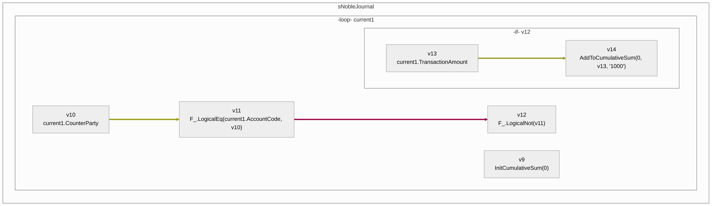

# title
teste

 

|aa|aa|
|--|--|
|AA|aa|

```mermaid
graph LR
%%{ init: { 'theme': 'neutral', 'flowchart': { 'useMaxWidth': false, 'curve': 'basis' }}}%%

	subgraph sNobleJournal
		subgraph -loop- current1
			v9["v9<br/>InitCumulativeSum(0)"]

			v11 ===> v12
			linkStyle 0 stroke:#904
			v12["v12\nF_.LogicalNot(v11)"]

			v10 ===> v11
			linkStyle 1 stroke:#991
			v11["v11<br/>F_.LogicalEq(current1.AccountCode, v10)"]

			v10["v10<br/>current1.CounterParty"]

			subgraph 1ifv12["-if- v12"]
				v13 ===> v14
				linkStyle 2 stroke:#992
				v14["v14<br/>AddToCumulativeSum(0, v13, '1000')"]

				v13["v13<br/>current1.TransactionAmount"]

			end

		end

	end
```
